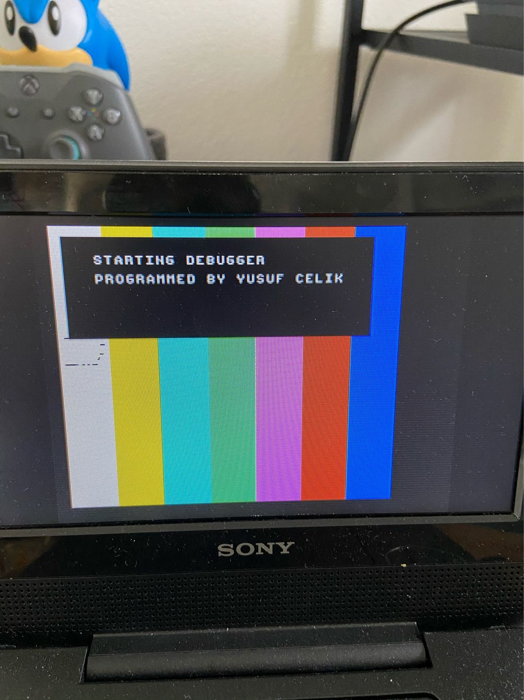
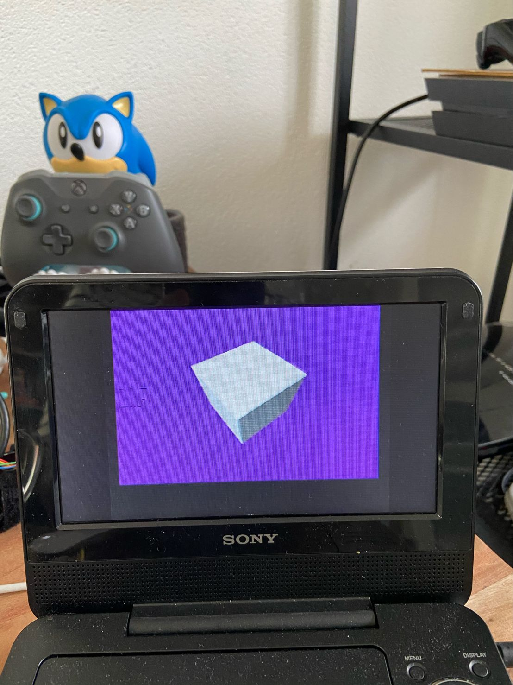

# Newroze
A Playstation Debugger 

In this repo you will find an .EXE file (Playstation executable) and ISO
that contains the Newroze Playstation Debugger. 
It is a debugger I have written that will enable you to launch and test Playstation code (ELF) via modern machines. 
To use this debugger you must have:

1. A Playstation with a cart (ActionReplay/Xplorer) to which you can directly upload the .EXE file. Or a modded Playstation on which you can run the burned ISO file.

2. A serial<->usb cable from the Playstation to your dev machine.

3. Mipsel-unknown-elf-gdb installed.

4. The Newroze GDB server: https://github.com/YusufCelik/newroze-psx-debugger

You can watch a demo of the debugger here (click on the image below to go to video):

## Load address
Keep in mind that the debugger itself uses around 32k of memory. It occupies this space from the 0x80010000 address onwards. Hence, the "debugee" (that is the ELF file that you wish to debug) has to start around address 0x80030000 or 0x80040000 (to be safe).

## Thanks 

To make this piece of software I had to rely on various pointers and information from the Playstation homebrew development community (Psxdev).
As such, I would like to thank Nicolas Noble, Asmblur, LameGuy, Sickle, DanHans, Trimesh, and others for their input and support.
